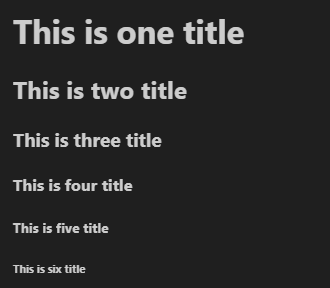

Sphinx
================================

Sphinx Grammar Guide
--------------------------------
Title
********************************

Formatting
********************************

普通的文本段落或块级之间，必须使用空行加以区分，可按两下回车继续书写。

类似python，同一段落的所有行必须左对齐而且同一级缩进。
每级缩进建议用4个空格，或设置Tab自动转为4个空格。

    这个是缩进段落。

    同级缩进段落

Font
********************************

